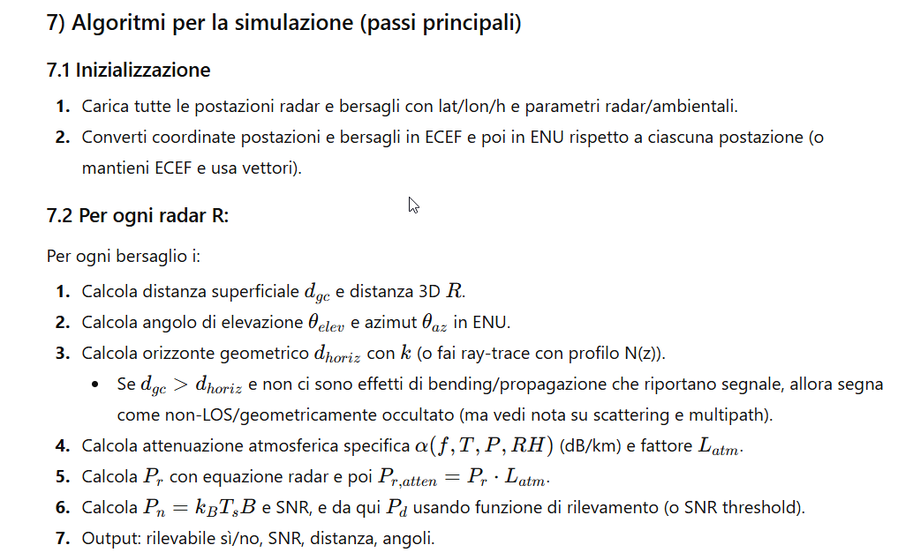
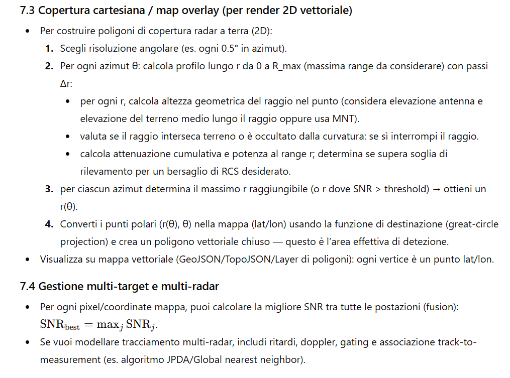

# radarsim
Radar Simulation Framework in Golang

## 1) Panoramica e input necessari

Per ogni postazione radar:

- latitudine φ_r (gradi), longitudine λ_r (gradi), elevazione h_r (m) sopra il livello del mare.
- parametri radar: potenza trasmessa (P_t) (W), guadagno (G) (lineare), frequenza (f) (Hz) o lunghezza d’onda (\lambda = c/f), larghezza di fascio (azimut/elevazione), perdite (L), sensibilità minima (S_{min}) (W) o SNR threshold, radar cross section (RCS) stimata per i bersagli (\sigma) (m²).
  Per ogni bersaglio i:
- latitudine φ_i, longitudine λ_i, elevazione h_i (m), velocità, RCS stimata (opzionale).
  Ambiente:
- temperatura (T) (K o °C), pressione (P) (hPa), umidità relativa RH (%) o contenuto di vapor d’acqua (e) (hPa), eventuale profilo verticale (opzionale).
  Costanti:
- raggio medio terrestre (R_e = 6371000\ \mathrm{m}) (valore comune), oppure usare WGS84 per conversioni ECEF.
- fattore di rifrazione (k) per l’effetto di bending dell’onda (valore standard spesso usato: (k\approx 4/3), ma può variare).

------

## 2) Coordinate e trasformazioni

### 2.1 Convertire lat/lon/elev → ECEF (Earth-Centered, Earth-Fixed)

Usa WGS84:
 Sia (a) semiasse maggiore, (e^2) eccentricità.
 Calcola:
 [
 N(\phi) = \frac{a}{\sqrt{1-e^2\sin^2\phi}}
 ]
 [
 X = (N(\phi)+h)\cos\phi\cos\lambda
 ]
 [
 Y = (N(\phi)+h)\cos\phi\sin\lambda
 ]
 [
 Z = \left((1-e^2)N(\phi) + h\right)\sin\phi
 ]
 (Questo ti dà coordinate cartesiane precise; utili per distanze 3D e trasformazioni.)

### 2.2 Sistema locale ENU (East-North-Up)

Per calcoli locali (angoli di elevazione, azimut) converti target e altri radar in coordinate ENU rispetto alla postazione radar:

- sottrai vettore ECEF della postazione, ruota con matrice basata su φ_r, λ_r:
  matrice (R) che mappa ECEF → ENU standard.

### 2.3 Distanze

- distanza 3D (R = | \mathbf{r}*{target} - \mathbf{r}*{radar} |) (m).
- distanza di superficie (great-circle) tra lat/lon: formula di haversine:
  [
  \Delta\sigma = 2\arcsin!\Big(\sqrt{\sin^2!\tfrac{\Delta\phi}{2} + \cos\phi_1\cos\phi_2\sin^2!\tfrac{\Delta\lambda}{2}}\Big)
  ]
  distanza superficiale (d_{gc} = R_e \Delta\sigma).

------

## 3) Linea di vista geometrica e orizzonte

### 3.1 Linea di vista geometrica (LOS)

Dall’ENU della postazione, l’angolo di elevazione verso il bersaglio:
 [
 \theta_{elev} = \arctan2(z_{enu}, \sqrt{x_{enu}^2 + y_{enu}^2})
 ]
 Se (\theta_{elev} > 0) generalmente il target è sopra l’orizzonte geometrico locale (a meno di ostacoli).

### 3.2 Orizzonte geometrico dovuto alla curvatura terrestre

Se vogliamo il limite dovuto alla curvatura, per un osservatore ad altezza (h_1) e oggetto ad altezza (h_2), la distanza massima alla quale possono vedersi (orizzonte geometrico combinato), assumendo raggio effettivo (R_e'), è approssimata da:
 [
 d_{horiz} \approx \sqrt{2 R_e' h_1} + \sqrt{2 R_e' h_2}
 ]
 con (R_e' = k R_e) (k = fattore efficace, ≈ 4/3 per condizioni standard di bending). Le radici in metri danno distanza in metri lungo la superficie. Se la distanza superficiale (d_{gc} > d_{horiz}), allora geometricamente non c’è vista diretta (line-of-sight bloccata dalla curvatura).

Derivazione rapida: per altezza h su sfera raggio R, tangente dà (d \approx \sqrt{2Rh}) per h≪R.

### 3.3 Orizzonte radar vs. orizzonte ottico

- L’orizzonte radar è esteso rispetto all’ottico quando l’indice di rifrazione atmosferica causa bending verso il basso (k>1). Usare k per tenerne conto.
- Inoltre i fasci radar hanno apertura verticale; l’energia può raggiungere oltre il limite geometrico per diffusione/propagazione non lineare (multipath), ma questo è più complesso.

------

## 4) Propagazione: attenuazione e factoring ambientale

### 4.1 Legge dell’attenuazione semplice

Se la stima di attenuazione specifica è (\alpha) (in dB/km) lungo la linea di vista, l’attenuazione totale in dB su distanza (R) (km) è:
 [
 A_{dB} = \alpha\cdot R
 ]
 e il fattore lineare:
 [
 L_{atm} = 10^{-A_{dB}/10}
 ]
 Quindi la potenza ricevuta teorica (P_r) viene moltiplicata per (L_{atm}).

### 4.2 Modelli per (\alpha) (umidità, temperatura, frequenza)

- **Pratica comune**: usare i modelli standard (ITU-R P.676 per attenuation by gases, P.838 per specific attenuation by water vapor, o modelli empirici) per ottenere (\alpha(f,T,P,RH)) in dB/km. Qui do la struttura:
  - attenuazione dovuta all’ossigeno ( \alpha_{O_2}(f,T,P) )
  - attenuazione dovuta al vapor d’acqua ( \alpha_{H_2O}(f,T,P,e) )
  - attenuazione totale (\alpha = \alpha_{O_2} + \alpha_{H_2O}) (possibili aggiunte per pioggia/nebbia con modelli P.838/P.838 etc.)
- Per pioggia e goccioline usare modelli di relazione tra intensità pioggia R (mm/h) e attenuazione specifica (\gamma_R) (dB/km): (\gamma_R = k R^\alpha) (le costanti dipendono dalla frequenza).

> Nota: se ti serve, posso fornire la forma esatta delle equazioni ITU-R o tabelle di coefficienti — sono standard del settore e molto usate nelle simulazioni.

------

## 5) Equazione radar (monostatico) — potenza ricevuta

Radarequazione (forma classica monostatica, libera propagazione, senza attenuazione atmosferica):
 [
 P_r = \frac{P_t G^2 \lambda^2 \sigma}{(4\pi)^3 R^4 L}
 ]
 dove:

- (P_t): potenza trasmessa (W)
- (G): guadagno dell'antenna (lineare)
- (\lambda): lunghezza d’onda (m)
- (\sigma): RCS del bersaglio (m²)
- (R): distanza radome-target (m) — per monostatico compare (R^4)
- (L): fattore di perdita (lineare), include perdite di sistema, efficienza, polarizzazione.

Per aggiungere attenuazione atmosferica:
 [
 P_{r,atten} = P_r \cdot L_{atm}
 ]
 con (L_{atm}=10^{-\alpha_{dB}R_{km}/10}).

### 5.1 SNR e probabilità di rilevamento

- Rumore a ricevitore: (P_n = k_B T_s B) (W), con (k_B) costante di Boltzmann, (T_s) temperatura equivalente di rumore (K), (B) banda in Hz.
- SNR: (\text{SNR} = \frac{P_{r,atten}}{P_n}).
- Per rilevamento integrato su (N) impulsi coherenti o non-coherenti, SNR aumenta: coherente ( \propto N^2) (in potenza dipende dal processamento), in pratica integrazione coerente aumenta SNR lineare con N per ampiezze; bisogna usare il modello del processamento adottato.
- Usare curve ROC o formule di rilevamento per target in funzione di SNR e threshold per determinare probabilità di rilevamento (P_d).

------

## 6) Effetto del profilo verticale (refractivity) e bending

- L’indice di rifrazione n(z) varia con pressione, temperatura, vapor d’acqua; si definisce numero di refrattività (N = (n-1)\times10^6). Gradienti di N con quota determinano bending.
- Modello compatto: usa un valore effettivo (k = \frac{1}{1 - (R_e / (R_bending))}) o direttamente (R_e' = k R_e). Valore tipico (k=4/3).
- Se hai profilo N(z), puoi ray-trace numericamente per calcolare traiettorie delle onde e determinare effettiva copertura oltre l’orizzonte geometrico. Algoritmo: integra equazioni del ray-tracing (Snell locale) lungo z. (Questo è opzionale ma migliora accuratezza.)

------

## 7) Algoritmi per la simulazione (passi principali)

### 7.1 Inizializzazione

1. Carica tutte le postazioni radar e bersagli con lat/lon/h e parametri radar/ambientali.
2. Converti coordinate postazioni e bersagli in ECEF e poi in ENU rispetto a ciascuna postazione (o mantieni ECEF e usa vettori).

### 7.2 Per ogni radar R:

Per ogni bersaglio i:

1. Calcola distanza superficiale (d_{gc}) e distanza 3D (R).
2. Calcola angolo di elevazione (\theta_{elev}) e azimut (\theta_{az}) in ENU.
3. Calcola orizzonte geometrico (d_{horiz}) con (k) (o fai ray-trace con profilo N(z)).
   - Se (d_{gc} > d_{horiz}) e non ci sono effetti di bending/propagazione che riportano segnale, allora segna come non-LOS/geometricamente occultato (ma vedi nota su scattering e multipath).
4. Calcola attenuazione atmosferica specifica (\alpha(f,T,P,RH)) (dB/km) e fattore (L_{atm}).
5. Calcola (P_r) con equazione radar e poi (P_{r,atten}=P_r \cdot L_{atm}).
6. Calcola (P_n = k_B T_s B) e SNR, e da qui (P_d) usando funzione di rilevamento (o SNR threshold).
7. Output: rilevabile sì/no, SNR, distanza, angoli.

### 7.3 Copertura cartesiana / map overlay (per render 2D vettoriale)

- Per costruire poligoni di copertura radar a terra (2D):
  1. Scegli risoluzione angolare (es. ogni 0.5° in azimut).
  2. Per ogni azimut θ: calcola profilo lungo r da 0 a R_max (massima range da considerare) con passi Δr:
     - per ogni r, calcola altezza geometrica del raggio nel punto (considera elevazione antenna e elevazione del terreno medio lungo il raggio oppure usa MNT).
     - valuta se il raggio interseca terreno o è occultato dalla curvatura: se sì interrompi il raggio.
     - calcola attenuazione cumulativa e potenza al range r; determina se supera soglia di rilevamento per un bersaglio di RCS desiderato.
  3. per ciascun azimut determina il massimo r raggiungibile (o r dove SNR > threshold) → ottieni un r(θ).
  4. Converti i punti polari (r(θ), θ) nella mappa (lat/lon) usando la funzione di destinazione (great-circle projection) e crea un poligono vettoriale chiuso — questo è l’area effettiva di detezione.
- Visualizza su mappa vettoriale (GeoJSON/TopoJSON/Layer di poligoni): ogni vertice è un punto lat/lon.

### 7.4 Gestione multi-target e multi-radar

- Per ogni pixel/coordinate mappa, puoi calcolare la migliore SNR tra tutte le postazioni (fusion): (\mathrm{SNR_{best}} = \max_j \mathrm{SNR}_j).
- Se vuoi modellare tracciamento multi-radar, includi ritardi, doppler, gating e associazione track-to-measurement (es. algoritmo JPDA/Global nearest neighbor).

------

## 8) Considerazioni pratiche e incremento di realismo

- **Terreno**: integra un Modello Digitale del Terreno (DEM). Per ogni raggio calcola profilo altimetrico e verifica occultamento.
- **Riflessioni e multipath**: includi un modello semplificato per riflessioni da mare o edifici se necessario.
- **Beam pattern reale**: non assumere guadagno costante su tutto il fascio — applica pattern antenna (G(\theta,\phi)).
- **Doppler e velocità**: se vuoi simulare detection + tracking, calcola shift doppler (f_d = \frac{2 v_r}{\lambda}) (dove (v_r) è componente radiale della velocità) e la larghezza di banda dell’impulso per stimare risoluzione in range/velocità.
- **Polarizzazione** e mismatch: applica fattori di perdita per mismatch.

------

## 9) Pseudocodice (alto livello) — calcolo copertura 2D vettoriale

```
for each radar in radars:
    compute ECEF_radar, local ENU basis
    for theta in 0 .. 360 step dtheta:
        r_max_detect = 0
        for r in dr .. R_limit step dr:
            point = destination_point(radar.lat, radar.lon, theta, r)  # great-circle
            h_terrain = sample_DEM(point.lat, point.lon)
            alt_ray = compute_ray_height_above_surface(r, theta, radar.height, Re_prime, beam_elevation)
            if alt_ray <= h_terrain + clearance:
                break  # occultato
            R3D = compute_3D_distance(radar.ECEF, point.ECEF, target_height)
            alpha = atmospheric_attenuation(f, T, P, RH, r)
            Pr = radar_eq(Pt, G, lambda, sigma, R3D, L)
            Pr_atten = Pr * 10^(-alpha*r/10)
            SNR = Pr_atten / (kB * Ts * B)
            if SNR >= SNR_threshold_for_RCS:
                r_max_detect = r
            # continue to find maximal r
        polygon_vertices.append(dest_point_from_polar(r_max_detect, theta))
    make_polygon(polygon_vertices) -> store as GeoJSON
```

------

## 10) Equazioni riassuntive (rapido compendio)

- ECEF (vedi sezione 2.1).
- Haversine per distanza di superficie.
- Angolo elevazione: (\theta_{elev}=\arctan2(z_{enu},\sqrt{x_{enu}^2+y_{enu}^2})).
- Orizzonte: (d_{horiz}\approx\sqrt{2R_e' h_1} + \sqrt{2R_e' h_2}) con (R_e' = k R_e).
- Radar equation (monostatico): (P_r = \dfrac{P_t G^2 \lambda^2 \sigma}{(4\pi)^3 R^4 L}).
- Attenuazione atmosferica: (A_{dB}=\alpha\cdot R_{km}); (L_{atm}=10^{-A_{dB}/10}).
- Rumore: (P_n = k_B T_s B). SNR = (P_{r,atten}/P_n).
- Doppler (radiale): (f_d = \dfrac{2 v_r}{\lambda}).

------

## 11) Output vettoriale per mappa 2D

Formati consigliati:

- **GeoJSON** per poligoni di copertura e layer di range-rings, con proprietà: { radar_id, timestamp, max_range_by_azimuth, detection_threshold }.
- **Vector tiles** (Mapbox/TileJSON) se hai grandi aree e performance.
- Ogni poligono è costruito convertendo punti polari alla superficie in lat/lon (destination point).
- Aggiungi layer separati per: linee di orizzonte, beam centerlines, punti bersaglio con simboli colorati (SNR colormap).

------

## 12) Validazione e test

- Testa su casi semplici: radar a livello del mare vs. bersaglio a 0 m → calcola orizzonte atteso.
- Confronta stime di range con formule approximate (\sqrt{2Rh}).
- Usa dataset DEM reali per verificare occultamento.
- Confronta attenuazione atmosferica con tabelle ITU per assicurare che il tuo (\alpha) sia plausibile.

------

## 13) Risorse e riferimenti consigliati (per implementazione accurata)

- ITU-R raccomandazioni per attenuazione da gas, vapor d’acqua e pioggia (es. P.676, P.838, P.452 per path loss).
- Test e dataset DEM (SRTM) per occultamento da terreno.
- Documentazione su WGS84 e conversioni ECEF/LLA.



 

## Riferimenti motori LLM

- Migliore: https://claude.ai/chat/40ebf1ba-c4e5-402f-a221-7865bbc5598d
- Medio, ma sul codice attuale: https://chatgpt.com/share/6935e604-fe78-800f-b1eb-11d7307baacf
